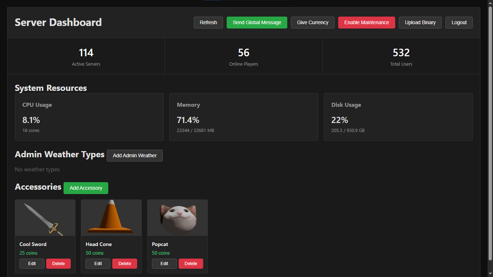

# Bloxon Server

Backend for [Bloxon](https://github.com/ZyyeDev/bloxon) - this wasn't really meant to be a standalone server, it's specifically the server for that game. But if you want to fork it for your own project, go ahead.

## What it does

- User accounts and auth
- Avatar customization + shop for accessories
- Virtual currency with Google Play payments
- Friends system (add people, join their servers)
- Private servers you can rent (not implemented in client yet)
- Moderation system
- WebSocket messages for broadcasts
- Admin dashboard to manage everything
- Handles payments and ad rewards

### How to set up

**Make sure you're using [Hetzner](https://www.hetzner.com/)**

1. Clone it:
```bash
git clone https://github.com/ZyyeDev/bloxon-server
cd bloxon-server
```

2. Make your `.env`:
```bash
cp .env.example .env
nano .env
```

3. Run the deploy script:
```bash
chmod +x deploy.sh
./deploy.sh
```
Save the dashboard password printed during the first run.

4. Configure the client:
   In the client project, duplicate `config.json.example`, rename it to `config.json`, and set the server ip to your backend's ip address:

```json
{
  "ip": "YOUR_SERVER_IP"
}
```

5. Upload your server binary thru the dashboard on http://SERVER_IP:8080/dashboard

**Done.**

## API stuff

### Auth
- `POST /auth/register` - make account
- `POST /auth/login` - login, get token
- `POST /auth/validate` - check if token still works

### Game servers
- `POST /request_server` - get connected to a server
- `GET /maintenance_status` - check if server is down for maintenance

### Player
- `POST /player/get_profile` - get someone's profile data
- `POST /player/update_avatar` - change avatar colors/accessories
- `POST /player/get_pfp` - get profile pic URL

### Currency
- `POST /currency/get` - check balance
- `POST /payments/purchase` - verify Google Play purchase
- `POST /payments/ad_reward` - claim ad reward
- `GET /payments/packages` - list currency packages

### Avatar & Shop
- `POST /avatar/list_market` - browse shop
- `POST /avatar/buy_item` - buy accessory
- `POST /avatar/equip` - equip accessory
- `POST /avatar/unequip` - unequip accessory

### Friends
- `POST /friends/send_request` - send friend request
- `POST /friends/accept_request` - accept request
- `POST /friends/get` - get friends list
- `POST /friends/join_server` - join friend's server

### Private Servers
- `POST /private_server/subscribe` - rent private server
- `POST /private_server/cancel` - cancel subscription
- `POST /private_server/status` - check if you have one active

## How it works


# Admin Dashboard

Go to `http://your-server:8080/dashboard`

Password gets auto-generated on first run, saved in `server_data/dashboard.pwd`

